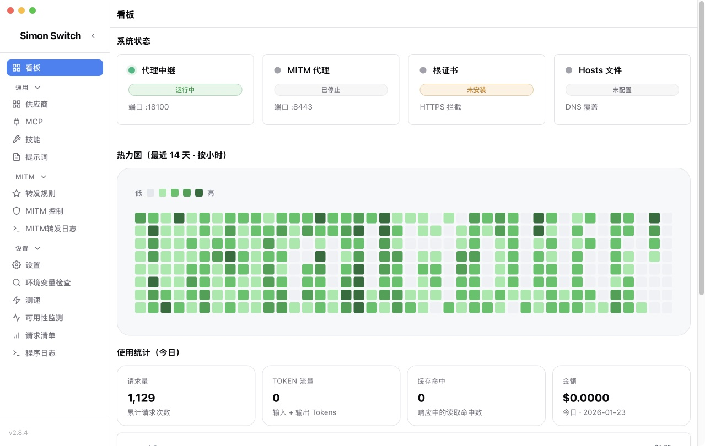
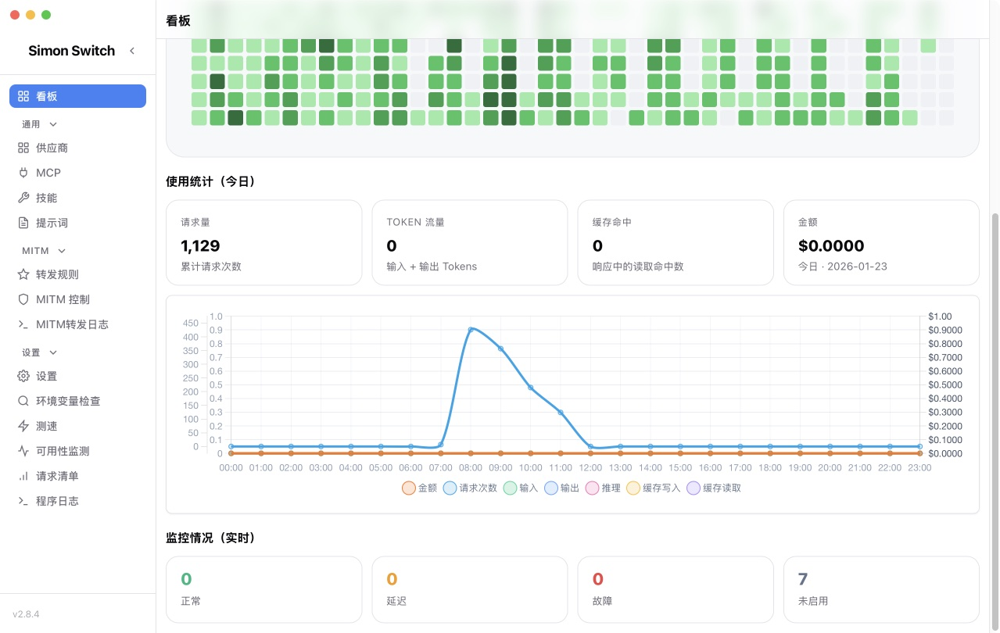
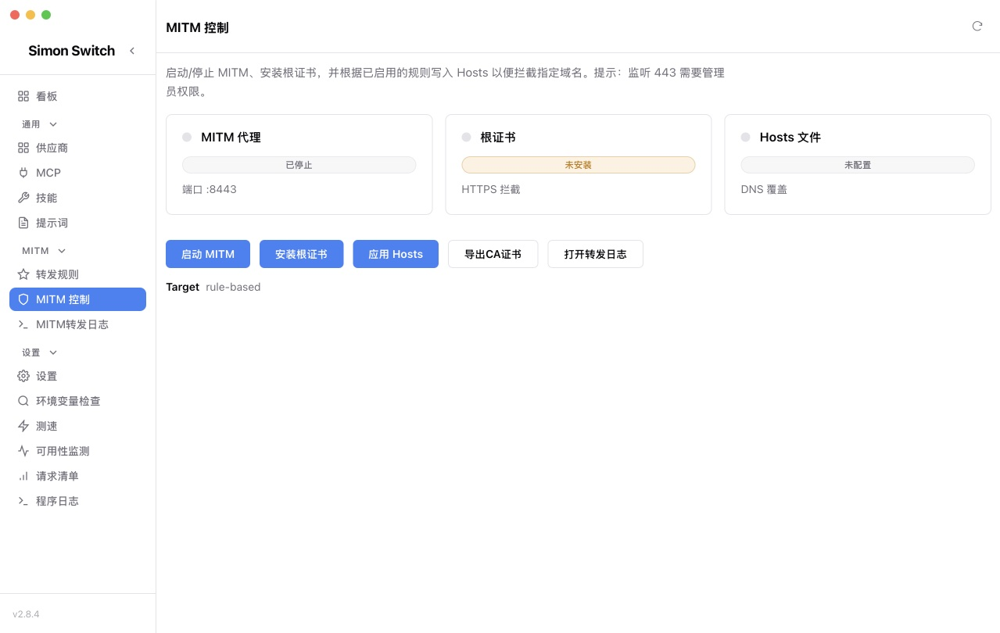
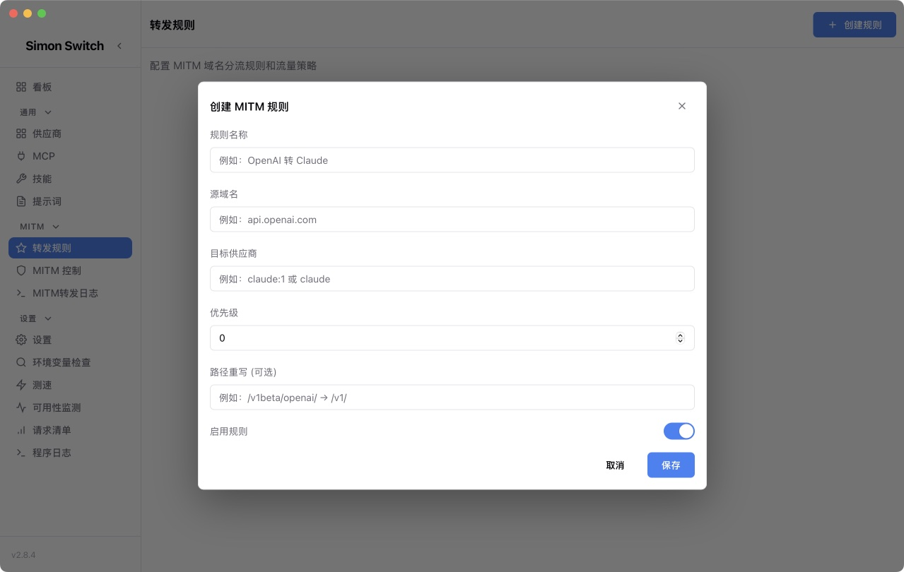

# Simon Switch

🚀 **Simon Switch** 是一款桌面应用：集中管理 Claude Code、Codex、Gemini CLI（以及自定义 CLI）的供应商配置，并通过本地代理实现**无感切换、故障降级、可观测与配置统一**。

## ✨ 核心特性

- **多平台统一管理**：Claude Code / Codex / Gemini CLI / 自定义 CLI 的 Provider、模型映射与白名单
- **智能路由与降级**：按 Level 分组调度 + 同 Level 轮询 + 黑名单/等级拉黑 + 可用性/连通性检测
- **高级 Header 与鉴权**：支持补充/覆盖/移除 Header；鉴权方式支持 `bearer` / `x-api-key` / `auto`
- **出站代理（新）**：支持 HTTP/HTTPS 与 SOCKS5 全局代理；可为 Claude/Codex/Gemini/Custom 分渠道选择是否走代理（覆盖转发 + 监控流量）
- **可观测性**：用量统计与日志；可记录请求详情（请求/响应头、body、耗时等，支持 off/fail_only/all）
- **配置生态**：MCP 服务器管理、CLI 配置编辑器、Skills、Prompts、速度测试、深度链接导入
- **配置导出/导入**：一键导出 `~/.code-switch`（zip + manifest），导入时自动备份，可选包含密钥/数据库
- **自动更新**：内置更新检查与校验

## 🧭 快速使用

1. 从 GitHub Releases 下载并安装（macOS/Windows/Linux）：https://github.com/SimonUTD/code-switch-R/releases
2. 打开应用，在对应平台添加 Provider 并启用代理（默认监听 `:18100`）
3. 在设置页可查看权限/环境变量冲突提示；在日志页查看用量与请求详情（如已开启）

> 配置与数据默认保存在 `~/.code-switch`；你可以在“设置 → 配置导入/导出”一键备份与迁移。
> 如需让本应用对上游请求走代理服务器，可在“通用设置 → 出站代理”配置全局代理与分渠道开关。

## 🖼️ 界面预览

| 主界面 | 主界面 |
|---|---|
|  |  |

| MITM | MITM规则 |
|---|---|
|  |  |

## 📚 文档

- 项目概览：`docs/PROJECT_OVERVIEW.md`
- 工程规范：`docs/ENGINEERING_GUIDELINES.md`
- 开发与构建：`docs/DEVELOPMENT.md`
- 发布与 GitHub Actions：`docs/RELEASE.md`

## 🤝 反馈与贡献

- 问题反馈：https://github.com/SimonUTD/code-switch-R/issues
- PR/功能建议：欢迎讨论与贡献

## 📄 License

本项目基于 [MIT License](LICENSE) 开源。

本项目fork 自 https://github.com/Rogers-F/code-switch-R 项目，在这个项目基础上进行开发。
---

**[⬆ 回到顶部](#code-switch-r)**

Made with ❤️ by [SimonUTD](https://github.com/SimonUTD)

